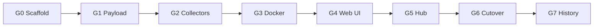

# Go rewrite — aşamalı uygulama planı (Java terk)

**Karar:** [ADR-008](DECISIONS/ADR-008-go-rewrite.md) — Java referans kalır, Go birincil runtime olana kadar `go/` altında geliştirilir.

**İlke:** Her faz sonunda **build + test + (mümkünse) run** — çalışır artefakt bırakmadan sonraki faza geçilmez.

---

## Özet yol haritası



| Faz | Çıktı | Java karşılığı |
|-----|--------|----------------|
| **G0** | Binary + heartbeat | Spring Boot shell |
| **G1** | JSON log satırı | MetricsCollector + log |
| **G2** | Host metrikleri | linux/mac/windows collectors |
| **G3** | Docker listesi | DockerContainerCollector |
| **G4** | Dashboard :8080 | MetricsController + static |
| **G5** | Hub + push + alerts | hub/* |
| **G6** | Docker image, tag v2 | JAR + compose |
| **G7** | SQLite history | Phase 10 backlog |

---

## G0 — Scaffold ✅ (tamamlandı)

**Hedef:** `cmd/agent`, `cmd/hub`, config, logging, Makefile, CI.

### Doğrulama (her değişiklikten sonra)

```bash
make go-build          # → go/bin/agent, go/bin/hub
make go-test           # → PASS
METRICS_COLLECTION_INTERVAL=5000 make go-run   # heartbeat log, Ctrl+C
make go-run-hub        # hub skeleton (exit veya heartbeat)
```

**Exit:** Agent SIGTERM ile temiz kapanır; CI `go test ./...` yeşil.

---

## G1 — Payload + scheduler

**Hedef:** Java `MetricsPayload` ile byte-uyumlu JSON log satırı.

| # | Görev | Dosya |
|---|--------|-------|
| 1.1 | `internal/payload/` struct'lar (CPU, mem, process, service, disk, network, container) | `payload/types.go` |
| 1.2 | Golden fixture: Java test/sample JSON → Go unmarshal/marshal | `payload/*_test.go`, `testdata/*.json` |
| 1.3 | `internal/scheduler/` ticker (`METRICS_COLLECTION_INTERVAL`) | `scheduler/ticker.go` |
| 1.4 | Agent: her tick'te stub payload + `encoding/json` log line | `cmd/agent`, `internal/runtime` |
| 1.5 | `collectedAt` RFC3339 (Java `Instant` uyumu) | payload |

### Build / run (G1 exit)

```bash
make go-build && make go-test
METRICS_COLLECTION_INTERVAL=5000 make go-run
# Beklenen: stdout veya metrics-collector.log benzeri TEK SATIR JSON / tick
# Golden: go test ./internal/payload/... -run Golden
```

**Exit kriteri:** En az 1 golden test Java örneği ile birebir alan adları; scheduler 5s'de bir log.

---

## G2 — OS collectors

**Hedef:** linux/darwin/windows — CPU, RAM, processes, services, disk, network.

| # | Görev | Dosya |
|---|--------|-------|
| 2.1 | `internal/collector/collector.go` interface | `Collect(ctx) (*payload.MetricsPayload, error)` |
| 2.2 | `internal/collector/linux/` — port Java test vektörleri | `*_linux.go`, `*_test.go` |
| 2.3 | `internal/collector/darwin/` | aynı |
| 2.4 | `internal/collector/windows/` | aynı |
| 2.5 | `runtime.GOOS` factory | `collector/factory.go` |
| 2.6 | Scheduler'a bağla — gerçek metrik log | `runtime/runner.go` |

### Build / run (G2 exit)

```bash
make go-build && make go-test
METRICS_COLLECTION_INTERVAL=10000 make go-run
# JSON'da: cpuLoad, usedMemory, processInfos[], serviceInfos[], diskUsage[], networkUsage[]
# Linux CI: GOOS=linux go test ./internal/collector/linux/...
```

**Exit:** Dev makinede (darwin) gerçek metrik; Linux matrix CI'da linux testleri yeşil.

---

## G3 — Docker collector (optional)

**Hedef:** V4 — `DOCKER_ENABLED=false` ile docker import yok, app başlar.

| # | Görev |
|---|--------|
| 3.1 | `internal/docker/` — socket client, container list |
| 3.2 | Compose label parity (Java ile aynı alanlar) |
| 3.3 | Ayrı interval + cache |
| 3.4 | Build tag veya no-op stub when disabled |

### Build / run (G3 exit)

```bash
DOCKER_ENABLED=true make go-run    # containers[] dolu
DOCKER_ENABLED=false make go-run   # containers[] boş veya yok, hata yok
make go-test
```

---

## G4 — Web API + React SPA (F0–F7)

**Hedef:** React SPA (`go/web/frontend`) Go agent/hub üzerinde; Stitch v2 layout; responsive.

| # | Görev | Dosya |
|---|--------|-------|
| F0 | Vite + React + TS + Tailwind, design tokens | `go/web/frontend/` |
| F1 | `embed.FS` + `make ui-build` | `internal/webui/`, `go/Makefile` |
| F2 | `/api/meta`, dev proxy, mode nav | `internal/web/`, `vite.config.ts` |
| F3 | Dashboard Overview + SSE + i18n | `routes/dashboard/` |
| F4 | Processes + Services + deep-links | `routes/processes/`, `routes/services/` |
| F5 | Containers master-detail + Container Metrics | `routes/containers/`, `routes/container-metrics/` |
| F6 | Hub route + agents API | `routes/hub/`, `internal/hub/` |
| F7 | Responsive + `tool/check_i18n_coverage.sh` | Tailwind breakpoints |

### Build / run (G4 exit)

```bash
make ui-build && make go-build && make go-test
METRICS_UI_ENABLED=true SERVER_PORT=8080 make go-run   # veya 9080 Java çakışması varsa
open http://localhost:8080/
open http://localhost:8080/containers
open http://localhost:8080/container-metrics?id=abc123def456&tab=overview
# Dev hot reload:
# Terminal 1: SERVER_PORT=9080 ./go/bin/agent
# Terminal 2: cd go/web/frontend && npm run dev
```

**Exit:** React SPA tüm route'larda çalışır; hub mode `make go-run-hub` + `/hub`.

---

## G5 — Hub + push + alerts

**Hedef:** `hub.html`, ingest, agent registry, webhook alerts.

| # | Görev |
|---|--------|
| 5.1 | `cmd/hub` — `POST /api/v1/ingest`, agent list |
| 5.2 | Agent push client (`METRICS_PUSH_*` env) |
| 5.3 | Hub static + hub API |
| 5.4 | Alert thresholds (CPU/RAM/container) — Java `AlertService` parity |
| 5.5 | Contract test: ingest JSON = agent payload |

### Build / run (G5 exit)

```bash
make go-build
# Terminal 1:
METRICS_HUB_ENABLED=true SERVER_PORT=8081 make go-run-hub
# Terminal 2:
METRICS_HUB_ENABLED=true METRICS_PUSH_URL=http://127.0.0.1:8081/api/v1/ingest make go-run
open http://localhost:8081/hub.html
curl -s http://localhost:8081/api/v1/agents | jq
```

---

## G6 — Deploy + Java deprecation

| # | Görev |
|---|--------|
| 6.1 | Multi-stage `Dockerfile.go` (agent + hub) |
| 6.2 | `docker-compose.go.yml` |
| 6.3 | Cross-compile: linux/amd64, arm64, darwin, windows |
| 6.4 | README: Java → maintenance mode |
| 6.5 | Tag `v2.0.0-go`, parity checklist imzala |

### Build / run (G6 exit)

```bash
make go-docker-build
docker compose -f docker-compose.go.yml up -d
./scripts/smoke-go.sh   # veya mevcut smoke'un Go varyantı
```

---

## G7 — Historic store (opsiyonel, post-cutover)

SQLite, tam payload ingest, retention profiles — [`HISTORY_ALERTS_DIAGNOSTICS_PLAN.md`](HISTORY_ALERTS_DIAGNOSTICS_PLAN.md).

---

## Java terk zaman çizelgesi

| Milestone | Aksiyon |
|-----------|---------|
| G4 merge | `make run` (Java) yerine `make go-run` günlük dev |
| G5 merge | Hub staging Go-only |
| G6 tag | Java `main` freeze; yalnızca güvenlik hotfix |
| +3 ay | Java artifact deprecated README |

---

## Her PR / adım checklist

```bash
make go-build
make go-test
# ilgili faz run komutu (yukarıda)
make ci-fast          # Java regression (G4'e kadar)
```

---

## Stitch UI referansı

Prompt dosyaları: `tool/stitch_prompt_containers_v2.txt`, `tool/stitch_prompt_container_metrics_v2.txt`  
Proje: https://stitch.withgoogle.com/projects/3503001314210425983

React implementasyonu Stitch v2 layout + design tokens ile hizalı (`go/web/frontend/src/design/tokens.ts`).
