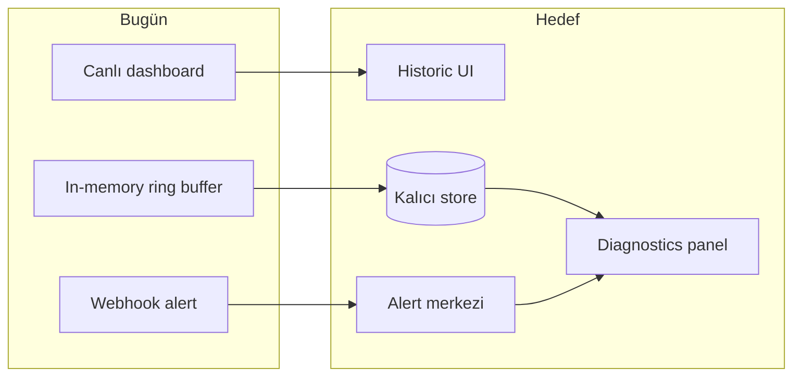

# Geçmiş analiz, alarmlar ve tanı — ürün planı

**Durum:** Planlama (implementasyon yok)  
**Önkoşul:** Phase 7 hub + Phase 3/6 dashboard tamamlandı  
**Hedef MVP:** MVP-2.5 → MVP-3 geçiş katmanı

---

## Özet vizyon

Bugün:

- Agent/hub **son snapshot + kısa ring buffer** (bellekte, restart’ta kaybolur)
- Alert: **eşik + webhook**, geçmişi yok
- UI: **canlı mod** — trend çizgileri sınırlı (`history.size=60`)

Hedef:

| Mod | Kullanıcı sorusu |
|-----|------------------|
| **Canlı** (mevcut) | “Şu an ne oluyor?” |
| **Geçmiş (Historic)** | “Dün gece CPU neden yükseldi?” |
| **Alarmlar** | “Ne zaman, hangi agent, hangi kural tetiklendi?” |
| **Tanı (Diagnostics)** | “Muhtemel kök neden ve önerilen adımlar neler?” |



---

## Mevcut durum (baseline)

| Bileşen | Kapasite | Sınır |
|---------|----------|-------|
| `MetricsSnapshotStore` | Son N snapshot (varsayılan 60) | JVM restart = veri kaybı |
| `HubAgentRegistry` | Per-agent ring buffer | Hub tek instance, RAM |
| `AlertService` | CPU/RAM/container → webhook | Kural seti sabit, geçmiş yok |
| Dashboard `/` | CPU/RAM bar, tablolar | Zaman aralığı seçimi yok |
| Hub `/hub.html` | Agent listesi + özet | Per-agent kısa geçmiş API var, UI’da grafik yok |

**Bilinen teknik borç (planı besler):** macOS `networkUsage` duplicate arayüz satırları; disk %94 gibi eşikler alert’e düşmeli.

---

## Phase 10 — Kalıcı geçmiş + Historic mod (önerilen sıra: 1)

**Ürün kodu:** M20  
**Segment:** Homelab power user, MSP, air-gapped edge

### Kapsam

**Backend (hub-first):**

- SQLite (veya H2 embedded) — hub’da `metrics_history` tablosu
- Ingest sonrası async yazım (ingest latency’yi artırmamak için)
- Retention policy: `metrics.history.retention.days`, `max.rows.per.agent`
- API:
  - `GET /api/v1/agents/{id}/history?from=&to=&resolution=`
  - `GET /api/v1/agents/{id}/series?metric=cpuLoad&from=&to=` (downsampled)

**Agent (opsiyonel, Phase 10b):**

- Yerel SQLite — `docker.enabled=false` + hub yok senaryosu
- Sync to hub when online (MVP-3+)

**UI — Historic mod:**

- Toggle: **Live | History** (header)
- Zaman seçici: Son 1s / 6s / 24s / 7g / özel aralık
- Grafikler: CPU, RAM, disk %, container sayısı (CSS bar veya hafif chart lib CDN)
- Hub: per-agent historic drill-down
- i18n: tüm yeni string’ler `en.json` / `tr.json` (V20)

### Exit criteria (gate taslağı)

- [ ] ADR-008: storage schema + retention
- [ ] Hub persist ingest (SQLite)
- [ ] History API + downsampling
- [ ] Dashboard + hub historic UI
- [ ] `make ci-fast` + migration smoke
- [ ] `docs/` deploy notu (disk boyutu)

### Council notları

- Payload şeması değişmez (V6); store ayrı tablo
- Log parse yok (V16); historic veri ingest/store’dan

---

## Phase 11 — Alert platformu (önerilen sıra: 2)

**Ürün kodu:** M21  
**Mevcut Phase 7 webhook’u evrimleştirir**

### Kapsam

**Kural motoru:**

```yaml
# örnek — config veya hub UI
rules:
  - id: cpu-sustained-high
    metric: cpuLoad
    condition: avg > 0.85 for 5m
    severity: warning
  - id: disk-critical
    metric: diskUsage.usePercent
    filter: mount == "/"
    condition: max > 90
    severity: critical
  - id: container-exited
    source: containers
    condition: status contains "exit"
```

**Alert yaşam döngüsü:**

- Durumlar: `OPEN` → `ACK` → `RESOLVED`
- Alert geçmişi DB’de (`alert_events`)
- Cooldown + dedup (aynı agent+kural)
- Kanallar: webhook (mevcut), email (MVP-3), Slack (MVP-3)

**UI — Alert merkezi:**

- `/alerts.html` veya hub içi sekme
- Filtre: agent, severity, zaman, durum
- “Sessize al” (silence) 1s/24s
- EN + TR

### Exit criteria

- [ ] ADR-009: alert model + severity
- [ ] Rule config (properties veya hub REST)
- [ ] Alert store + REST API
- [ ] Webhook payload v2 (backward compatible alanlar)
- [ ] Alert UI + i18n
- [ ] Unit test: rule evaluation, dedup

### Mevcut `AlertService` ile ilişki

Phase 7 `AlertService` → Phase 11’de `AlertEngine` + `NotificationDispatcher` olarak refactor; sabit eşikler varsayılan kural seti olur.

---

## Phase 12 — Tanı ve içgörü (Diagnostics) (önerilen sıra: 3)

**Ürün kodu:** M22  
**Segment:** MSP L1 destek, ajans, solo admin

### Kapsam

**Tanı motoru (kural tabanlı MVP, ML değil):**

| Insight tipi | Tetikleyici | Çıktı |
|--------------|-------------|-------|
| `CPU_SPIKE` | 5 dk içinde 2x artış | Top process listesi o anki snapshot’tan |
| `MEMORY_PRESSURE` | RAM > eşik 10 dk | Öneri: swap, top memory processes |
| `DISK_FILLING` | Disk usePercent trend ↑ | “X günde dolabilir” (lineer extrapolation) |
| `CONTAINER_FLAP` | restartCount artışı | Container adı + son status |
| `AGENT_STALE` | Hub’da lastSeen > 2× interval | Agent offline uyarısı |
| `DOCKER_UNAVAILABLE` | Collector docker hatası | “Docker socket kontrol edin” |

**Diagnostics API:**

- `GET /api/v1/agents/{id}/diagnostics` — açık insight listesi
- `GET /api/v1/agents/{id}/diagnostics/{insightId}` — detay + önerilen adımlar (markdown)

**UI:**

- Agent detayında **Diagnostics** paneli
- Severity badge (info / warning / critical)
- “Son 24 saatte” özeti
- Export: JSON veya kısa metin (destek ticket’ı için)

**Alarm entegrasyonu:**

- Critical insight → otomatik alert kuralı (opsiyonel)
- Alert ACK sonrası ilgili diagnostic “acknowledged”

### Exit criteria

- [ ] ADR-010: diagnostics insight schema
- [ ] `DiagnosticEngine` scheduled + on-ingest
- [ ] REST + UI panel
- [ ] EN/TR runbook string’leri locale dosyasında (V20)
- [ ] Test: fixture snapshot → beklenen insight

---

## UI bilgi mimarisi (hedef)

```
┌─ Header: [Live | History]  [Alerts (3)]  [EN ▾] ─────────────┐
├─ Agent dashboard (mevcut)                                    │
├─ History mode: zaman çubuğu + CPU/RAM/disk grafikleri        │
├─ Alerts drawer: açık olaylar, filtre, ack                    │
└─ Diagnostics: insight kartları + “önerilen adımlar”          │
```

Hub (`/hub.html`) aynı modları agent seçimine göre gösterir.

---

## Veri modeli taslağı (hub SQLite)

```sql
-- metrics (downsampled raw + hourly rollups)
CREATE TABLE metric_samples (
  agent_id TEXT NOT NULL,
  collected_at TEXT NOT NULL,
  cpu_load REAL,
  used_memory INTEGER,
  total_memory INTEGER,
  payload_json TEXT,          -- full payload, retention sınırlı
  PRIMARY KEY (agent_id, collected_at)
);

CREATE TABLE alert_events (
  id TEXT PRIMARY KEY,
  agent_id TEXT NOT NULL,
  rule_id TEXT NOT NULL,
  severity TEXT NOT NULL,
  status TEXT NOT NULL,         -- OPEN, ACK, RESOLVED
  fired_at TEXT NOT NULL,
  resolved_at TEXT,
  details_json TEXT
);

CREATE TABLE diagnostic_insights (
  id TEXT PRIMARY KEY,
  agent_id TEXT NOT NULL,
  type TEXT NOT NULL,
  severity TEXT NOT NULL,
  detected_at TEXT NOT NULL,
  summary_key TEXT NOT NULL,    -- i18n key
  details_json TEXT
);
```

Detay şema Phase 10 gate’inde ADR ile kesinleşir.

---

## Öncelik ve tahmini effort

| Faz | Değer | Effort (1 dev) | Bağımlılık |
|-----|-------|----------------|------------|
| **Phase 10** Historic | Yüksek — “ürün” hissi | 2–3 hafta | — |
| **Phase 11** Alerts | Yüksek — MSP | 2 hafta | Phase 10 (alert history) |
| **Phase 12** Diagnostics | Orta-yüksek — farklılaşma | 2–3 hafta | Phase 10 + 11 |

**Önerilen sıra:** 10 → 11 → 12 (diagnostics, geçmiş veri ve alert olayları olmadan sınırlı kalır).

---

## Bilinçli kapsam dışı (şimdilik)

- ML/anomaly detection
- Log aggregation (Loki/ELK)
- Tam ITSM entegrasyonu (ServiceNow vb.)
- Prometheus remote write
- Multi-region hub replication

Bunlar MVP-3+ veya ayrı ADR.

---

## İlgili dokümanlar

- [`PHASE_GATES.md`](PHASE_GATES.md) — Phase 10–12 backlog
- [`PRODUCT_SPEC.md`](PRODUCT_SPEC.md) — M20–M22
- [`UI_PLAN.md`](UI_PLAN.md) — Historic / Alerts / Diagnostics UI
- [`HUB.md`](HUB.md) — mevcut hub API
- M18 (SQLite) bu planda Phase 10 ile birleştirildi

---

## Onay gereksinimi

Her faz için:

1. Kullanıcı onayı + Council gate (yeni veto maddeleri: persist güvenliği, PII in store)
2. ADR (008–010)
3. `make ci-smoke` genişletmesi

**Sonraki adım:** Phase 10 için ADR-008 taslağı + kullanıcı onayı.
