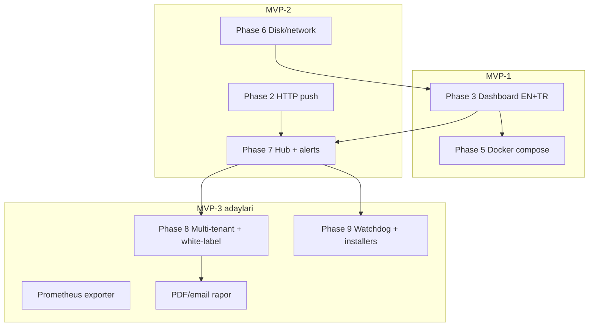

# Pazar senaryoları ve müşteri segmentleri

Hangi müşterilere, hangi senaryolarda hitap ederiz — özellik eşlemesi ve faz planı.

**Konumlandırma:** Monitoring odaklı kalırız. Patch management, remote access, PSA/ticketing **kapsam dışı** (Breeze, Tactical RMM ile yarışmayız).

Detaylı MVP: [`PRODUCT_SPEC.md`](PRODUCT_SPEC.md) · Faz planı: [`PHASE_GATES.md`](PHASE_GATES.md)

---

## Özet matris

| # | Segment | Öncelik | MVP | Eksik özellikler (özet) |
|---|---------|---------|-----|-------------------------|
| 1 | Homelab / self-hoster | Yüksek | MVP-1 | Dashboard (Phase 3) |
| 2 | Java / Spring shop | Yüksek | MVP-1 → MVP-3 | Prometheus exporter, starter |
| 3 | TR MSP / KOBİ | Yüksek | MVP-2 → MVP-3 | Multi-tenant, white-label, rapor |
| 4 | Windows filo (kiosk / POS / signage) | Yüksek | MVP-2 → MVP-3 | Windows service, watchdog, outbound push |
| 5 | Edge / IoT Docker filoları | Orta | MVP-2 | Outbound push, düşük bant modu, alert |
| 6 | CI/CD runner filoları | Orta | MVP-1 → MVP-2 | Hub, runner etiketleme |
| 7 | Ajans / hosting sağlayıcı | Orta | MVP-2 → MVP-3 | Paylaşım linki, PDF rapor |
| 8 | Air-gapped / kamu | Orta | MVP-2 | Offline hub, SQLite history |
| 9 | Eğitim / lab | Düşük | MVP-2 | Toplu agent kurulum |

**Öncelik formülü:** pazar boşluğu × mevcut yetenek uyumu. En yüksek diferansiyasyon: **TR MSP** ve **Windows filo** (rakipler çoğunlukla Linux-first).

---

## Segment detayları

### 1. Homelab / self-hoster

| Alan | İçerik |
|------|--------|
| **Persona** | Indie dev, homelab meraklısı, 1–5 VPS veya ev sunucusu |
| **Senaryo** | Grafana kurmadan CPU/RAM/Docker görmek; `docker compose` stack izleme |
| **Bugün karşılanan** | JSON log, OS collectors, Docker cache, smoke test |
| **Gereken** | Dashboard (Phase 3), `docker compose` (Phase 5) |
| **Faz** | MVP-1 (Phase 3 + 5) |
| **Rakip** | Beszel, Netdata, Glances |

**Pitch:** *“5 dakikada kur, tarayıcıdan izle — Prometheus stack yok.”*

---

### 2. Java / Spring shop (internal tooling)

| Alan | İçerik |
|------|--------|
| **Persona** | Platform / backend ekibi, JVM stack’te kalan şirket |
| **Senaryo** | Staging/prod sunucularında internal health panel; mevcut Spring bilgisiyle özelleştirme |
| **Bugün karşılanan** | Spring Boot agent, strategy pattern, unit test altyapısı |
| **Gereken** | Dashboard, opsiyonel `spring-boot-starter` modülü, Prometheus `/metrics` |
| **Faz** | MVP-1 (dashboard) → MVP-3 (exporter, starter) |
| **Rakip** | Micrometer + Actuator (metrik var, Docker/host süreç UI yok) |

**Pitch:** *“Ekibin zaten bildiği stack — fork edip genişlet.”*

---

### 3. TR MSP / KOBİ IT

| Alan | İçerik |
|------|--------|
| **Persona** | 5–50 müşterili yerel MSP, KOBİ’ye sunucu yönetimi |
| **Senaryo** | Müşteri başına sunucu sağlığı; Türkçe panel; veri Türkiye’de; KVKK |
| **Bugün karşılanan** | Cross-OS collector, TR UI planı (Phase 3), self-hosted mimari |
| **Gereken** | Hub multi-tenant, white-label, PDF/email rapor, outbound agent |
| **Faz** | MVP-2 (hub + alert) → MVP-3 (tenant, white-label, rapor) |
| **Rakip** | Fivenines, NetLock RMM, Breeze (genel RMM — biz monitoring-only) |

**Pitch:** *“RMM değil — sadece izleme. Türkçe, self-hosted, müşteri başına rapor.”*

Pazar referansı: Fivenines €27/ay self-serve, white-label status; Breeze multi-tenant AGPL.

---

### 4. Windows filo — kiosk / signage / POS

| Alan | İçerik |
|------|--------|
| **Persona** | Digital signage, perakende POS, medya sunucusu operatörü |
| **Senaryo** | 10–500 Windows makine; uygulama çöktü mü; CPU/RAM; firewall arkası outbound bağlantı |
| **Bugün karşılanan** | `WindowsMetricsCollector`, `tasklist`/`wmic`, servis listesi |
| **Gereken** | Windows Service kurulumu (MSI/sc), süreç watchdog, hub push, alert |
| **Faz** | MVP-2 (push + alert) → MVP-3 (installer, watchdog) — Phase 9 |
| **Rakip** | Owlette (Python/Windows), Beszel (Linux-first) |

**Pitch:** *“Windows-native agent — signage filonuz için hafif izleme, inbound port yok.”*

---

### 5. Edge / IoT Docker filoları

| Alan | İçerik |
|------|--------|
| **Persona** | Edge DevOps, sahada Docker çalışan cihazlar (perakende, fabrika, şube) |
| **Senaryo** | Firewall arkası; container health; merkeze outbound metrik; düşük bant |
| **Bugün karşılanan** | Docker collector, compose label, container health/restart |
| **Gereken** | Outbound-only push, webhook alert, sparse push modu, hub |
| **Faz** | MVP-2 (Phase 7) → opsiyonel SQLite history (Phase 8+) |
| **Rakip** | Daployi, Portainer (farklı odak — deploy vs izleme) |

**Pitch:** *“Agent dışarı bağlanır — firewall açmaya gerek yok.”*

---

### 6. CI/CD runner filoları

| Alan | İçerik |
|------|--------|
| **Persona** | Platform ekibi, self-hosted GitHub Actions / Jenkins runner yöneticisi |
| **Senaryo** | Build makinesi doygun mu; hangi runner yüklü; container’lar temizlendi mi |
| **Bugün karşılanan** | Süreç + Docker metrikleri, scheduled collection |
| **Gereken** | Hub’da runner etiketleme (`agent.labels`), alert, disk metrikleri (Phase 6) |
| **Faz** | MVP-1 (lokal dashboard) → MVP-2 (hub) |
| **Rakip** | Grafana Cloud runners, custom scripts |

**Pitch:** *“Runner farm’ınızı tek panelden — Java shop’lar için doğal fit.”*

---

### 7. Ajans / hosting sağlayıcı

| Alan | İçerik |
|------|--------|
| **Persona** | Web ajansı, küçük hosting firması (müşteri VPS’leri) |
| **Senaryo** | Müşteriye “sunucunuz sağlıklı” kanıtı; read-only link; aylık özet |
| **Bugün karşılanan** | Per-host agent, JSON log |
| **Gereken** | Hub, read-only paylaşım token, PDF/email rapor, white-label |
| **Faz** | MVP-2 → MVP-3 |
| **Rakip** | Uptime Kuma (uptime only), Fivenines status pages |

**Pitch:** *“Müşterinize paylaşılabilir sağlık linki — tam RMM değil.”*

---

### 8. Air-gapped / kamu / regüle sektör

| Alan | İçerik |
|------|--------|
| **Persona** | Kamu IT, savunma yan sanayi, banka iç ağı |
| **Senaryo** | İnternet yok; tüm veri iç ağda; denetim izi |
| **Bugün karşılanan** | Self-hosted JAR, log-first, dış bağımlılık yok (CDN hariç — UI static local) |
| **Gereken** | Offline hub, SQLite kalıcı history, auth, audit log |
| **Faz** | MVP-2 (on-prem hub) → backlog (SQLite, audit) |
| **Rakip** | Prometheus on-prem, özel çözümler |

**Pitch:** *“Veri dışarı çıkmaz — tek JAR, air-gap dokümante.”*

**Not:** Dashboard CDN kullanmaz (Chart.js vb. static bundle içinde — V20).

---

### 9. Eğitim / lab ortamları

| Alan | İçerik |
|------|--------|
| **Persona** | Üniversite lab, bootcamp, sertifika kursu |
| **Senaryo** | 20–50 öğrenci makinesi veya lab sunucusu izleme |
| **Bugün karşılanan** | Cross-OS, düşük kurulum |
| **Gereken** | Hub, toplu kurulum scripti, basit UI |
| **Faz** | MVP-2+ (düşük öncelik) |
| **Rakip** | Nagios legacy, custom scripts |

**Pitch:** *“Lab sunucularını tek dashboard — düşük bütçe.”*

---

## Özellik ekseni → segment eşlemesi

| Özellik | Segmentler | Faz / MVP |
|---------|------------|-----------|
| Local dashboard (EN+TR) | Tümü | MVP-1, Phase 3 |
| `docker compose` kurulum | Homelab, edge, ajans | MVP-1, Phase 5 |
| HTTP / hub ingest (outbound) | MSP, edge, kiosk, CI | MVP-2, Phase 2+7 |
| Webhook alert | Tümü | MVP-2, Phase 7 |
| Multi-tenant hub | MSP, ajans | MVP-3, Phase 8 |
| White-label / tema | MSP | MVP-3, Phase 8 |
| Windows Service / MSI installer | Kiosk, POS | MVP-3, Phase 9 |
| systemd unit (Linux) | Edge, homelab | MVP-3, Phase 9 |
| Süreç/servis watchdog kuralları | Kiosk, hosting | MVP-3, Phase 9 |
| PDF / email periyodik rapor | MSP, ajans | MVP-3 |
| Read-only paylaşım linki | Ajans, hosting | MVP-3 |
| Prometheus exporter | Java shop | MVP-3 |
| `spring-boot-starter` embed | Java shop, platform | MVP-3 |
| SQLite kalıcı history | Edge, air-gapped | Backlog |
| Düşük bant push modu | Edge, IoT | MVP-2+ |
| Disk/network metrikleri | Tümü | Phase 6 |
| GraalVM native image | Edge (araştırma) | Araştırma |

---

## Yol haritası özeti

---

## Bilinçli kapsam dışı

Aşağıdakiler ürün vizyonuna **girmez** (monitoring-only):

- Patch management, OS güncelleme
- Remote desktop / shell
- PSA, ticketing, faturalama
- Vulnerability scanning (paket CVE)
- AI operator / otomatik remediation

Bu alanlarda Breeze, Tactical RMM, Atera gibi tam RMM’lerle yarışılmaz.

---

## Segment → gelir modeli (taslak)

| Segment | OSS | Pro / ücretli |
|---------|-----|----------------|
| Homelab | Tam özellik local dashboard | Destek yok |
| Java shop | Agent + dashboard | Starter modül, enterprise support |
| TR MSP | Agent OSS | Hub multi-tenant, white-label, rapor — flat veya per-agent |
| Windows filo | Agent OSS | Watchdog + merkezi hub lisansı |
| Ajans | Agent OSS | Paylaşım linki + rapor (Pro) |

MSP fiyat referansı: Fivenines ~€27/ay; NetLock Community 25 endpoint ücretsiz. Bizim model: **flat hub lisansı** veya **per-agent** (10 agent’a kadar flat, üstü kademeli).

---

## İlgili dokümanlar

- [`PRODUCT_SPEC.md`](PRODUCT_SPEC.md) — MVP-1/2/3 kapsamı
- [`PHASE_GATES.md`](PHASE_GATES.md) — Phase 8–9 backlog
- [`UI_PLAN.md`](UI_PLAN.md) — dashboard + i18n
