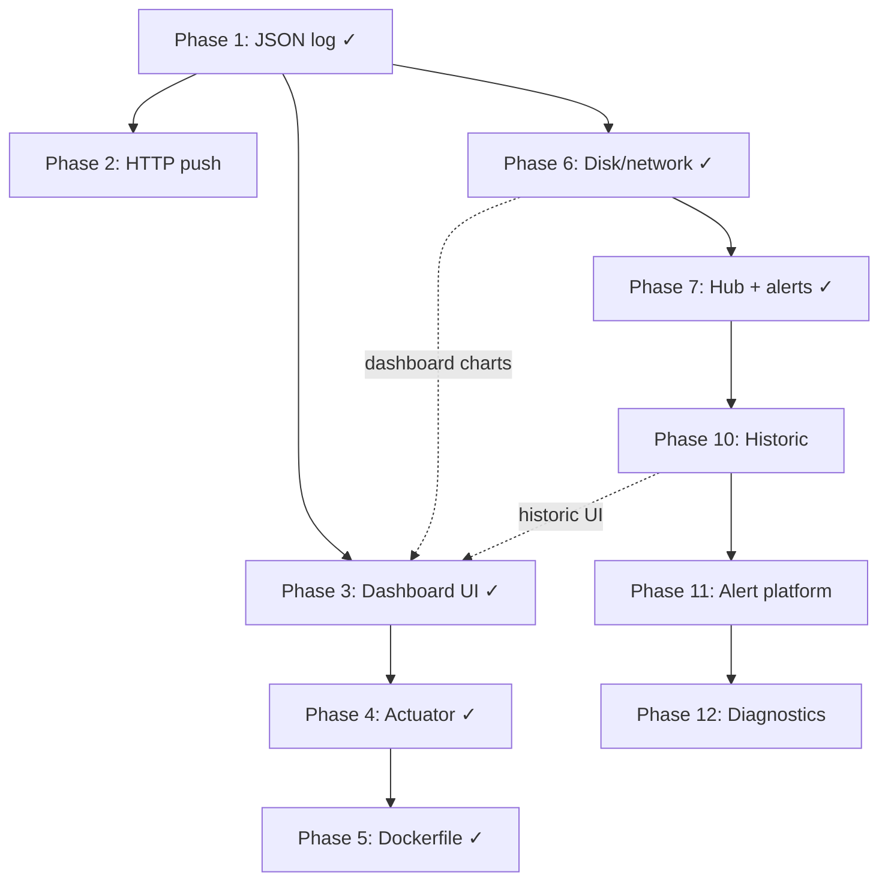

# Phase gates

Phase N+1 work requires Phase N exit criteria met **and explicit user approval** where noted (V12, V13, V19).

## Phase 1 — Core metrics + JSON log (COMPLETE)

**Scope:** OS strategy collectors, scheduled `MetricsPayload` JSON to log, optional Docker cache.

**Exit criteria:**
- [x] `MetricsCollector` per OS with `@Primary` selection
- [x] `InstanceMetricsSender` scheduled loop
- [x] Unit tests for sender and Docker collector
- [x] Smoke test asserts JSON payload fields
- [x] `docker.enabled=false` allows clean startup

**Status:** Current production baseline.

---

## Phase 2 — HTTP push

**Scope:** POST `MetricsPayload` to `metrics.api.endpoint` via `RestTemplate`.

**Entry gate:** User approval required (V12).

**Exit criteria:**
- [ ] HTTP send wired in `InstanceMetricsSender` (or dedicated client)
- [ ] Configurable endpoint, timeout, retry policy
- [ ] Failure does not crash scheduler (V11)
- [ ] Unit tests with mocked `RestTemplate`
- [ ] ADR documents push semantics
- [ ] `make ci-smoke` still passes

---

## Phase 3 — Metrics Dashboard UI (COMPLETE)

**Scope:** Kullanıcı dostu canlı metrik arayüzü — in-memory snapshot store, REST/SSE API, embedded static dashboard.

**Exit criteria:**
- [x] `MetricsSnapshotStore` with configurable history ring buffer
- [x] `InstanceMetricsSender` writes snapshot after each collection (log output unchanged)
- [x] REST: `/api/metrics/current`, `/api/metrics/history`
- [x] SSE: `/api/metrics/stream`
- [x] Dashboard at `/` — CPU, RAM, processes, services, containers
- [x] i18n: English + Turkish (`locales/en.json`, `locales/tr.json`), language switcher
- [x] `metrics.ui.default-locale` and `metrics.ui.locales` config
- [x] `tool/i18n_lint.sh` passes (key parity)
- [x] `metrics.ui.enabled=false` headless mode (V18)
- [x] Unit + WebMvc tests
- [x] Documented in README and `docs/UI_PLAN.md`

**Status:** Implemented. Run `make run` → `http://localhost:8080`

**Plan:** [`UI_PLAN.md`](UI_PLAN.md)  
**ADR:** [`DECISIONS/ADR-003-metrics-dashboard.md`](DECISIONS/ADR-003-metrics-dashboard.md), [`ADR-004-dashboard-i18n.md`](DECISIONS/ADR-004-dashboard-i18n.md)

---

## Phase 4 — Actuator health endpoints (COMPLETE)

**Scope:** Expose Spring Boot Actuator health/readiness for deployment orchestration.

**Entry gate:** User approval (V13) — implemented per roadmap continuation.

**Exit criteria:**
- [x] Actuator endpoints configured via `metrics.actuator.enabled` + `ActuatorEnabledConfiguration`
- [x] Security review — health only, no details, no env/beans (ADR-007)
- [x] Documented in [`ACTUATOR.md`](ACTUATOR.md) and README
- [x] Distinct from dashboard UI (`/actuator/health*` vs `/api/metrics/*`)

**Status:** See [`ACTUATOR.md`](ACTUATOR.md)

---

## Phase 5 — Dockerfile + deployment (COMPLETE)

**Scope:** Containerize the agent for host/Docker deployment.

**Exit criteria:**
- [x] `Dockerfile` multi-stage build
- [x] `docker-compose.yml` with socket mount
- [x] Document socket mount for Docker-in-Docker monitoring
- [x] Document `metrics.ui.enabled` for headless container deploy
- [x] `make docker-smoke` — compose build + API probe

**Status:** See [`DEPLOYMENT.md`](DEPLOYMENT.md)

---

## Phase 6 — Disk/network metrics in payload (COMPLETE)

**Scope:** Add disk and network usage to `MetricsPayload` (interface exists on macOS).

**Exit criteria:**
- [x] Fields added to `MetricsPayload` (backward compatible — V6)
- [x] Implemented for Linux, macOS, Windows
- [x] Dashboard charts updated for new fields
- [x] ADR for schema extension — [ADR-005](DECISIONS/ADR-005-disk-network-payload.md)
- [x] Unit tests per platform collector

## Phase overview

---

## Phase 7 — Hub + alerts (MVP-2, pazar) (COMPLETE)

**Scope:** Merkezi hub, çoklu agent ingest, basit webhook alert.

**Entry gate:** MVP-1 (Phase 3 + 5) tamamlandı. Beta feedback önerilir; implementasyon başlatıldı.

**Exit criteria:**
- [x] Hub ingest API (`POST /api/v1/ingest`)
- [x] Agent → hub push (`metrics.push.enabled`)
- [x] Hub dashboard: agent listesi, per-agent metrik (`/hub.html`)
- [x] Alert: CPU/RAM threshold, container exited → webhook
- [x] ADR for hub topology — [ADR-006](DECISIONS/ADR-006-hub-topology.md)
- [x] Documented in [`HUB.md`](HUB.md) and [`PRODUCT_SPEC.md`](PRODUCT_SPEC.md)

**Status:** See [`HUB.md`](HUB.md)

---

## Backlog — faz adayları (gate yok, kullanıcı onayı gerekir)

Aşağıdaki fazlar **resmi gate değildir**; MVP-2 tamamlandıktan sonra önceliklendirme ile açılır. Her biri için ayrı kullanıcı onayı ve ADR gerekir.

### Phase 10 — Kalıcı geçmiş + Historic mod (MVP-2.5)

**Hedef segment:** Power user, MSP, air-gapped

**Taslak kapsam:**
- Hub SQLite (M18 ile birleşik) — ingest sonrası kalıcı `metric_samples`
- Retention policy + downsampled series API
- UI: **Live | History** toggle, zaman aralığı, CPU/RAM/disk grafikleri
- Agent yerel history (opsiyonel Phase 10b)

**Önkoşul:** Phase 7 hub  
**Plan:** [`HISTORY_ALERTS_DIAGNOSTICS_PLAN.md`](HISTORY_ALERTS_DIAGNOSTICS_PLAN.md)

---

### Phase 11 — Alert platformu

**Hedef segment:** MSP, homelab

**Taslak kapsam:**
- Kural motoru (eşik, süre, severity)
- Alert geçmişi (OPEN/ACK/RESOLVED), UI alert merkezi
- Webhook v2 + kanal genişlemesi (email/Slack MVP-3)
- Phase 7 `AlertService` evrimi

**Önkoşul:** Phase 10 (alert history için persist)  
**Plan:** [`HISTORY_ALERTS_DIAGNOSTICS_PLAN.md`](HISTORY_ALERTS_DIAGNOSTICS_PLAN.md)

---

### Phase 12 — Tanı ve içgörü (Diagnostics)

**Hedef segment:** MSP L1, ajans

**Taslak kapsam:**
- Kural tabanlı insight’lar (CPU spike, disk trend, agent stale, docker down)
- Diagnostics API + UI paneli + runbook önerileri (i18n)
- Critical insight → alert entegrasyonu

**Önkoşul:** Phase 10 + 11  
**Plan:** [`HISTORY_ALERTS_DIAGNOSTICS_PLAN.md`](HISTORY_ALERTS_DIAGNOSTICS_PLAN.md)

---

### Phase 8 — Multi-tenant hub + white-label (MVP-3)

**Hedef segment:** TR MSP, ajans

**Taslak kapsam:**
- Hiyerarşi: Partner (MSP) → Organization (müşteri) → Site → Agent
- Tenant izolasyonu, RBAC
- White-label: logo, renk, `metrics.ui` tema
- Güvenlik vetoları bu faz gate’inde tanımlanır (yeni Council maddeleri)

**Önkoşul:** Phase 7 (hub + alert) tamamlandı

---

### Phase 9 — Watchdog + platform installers (MVP-3)

**Hedef segment:** Windows kiosk/POS, edge Linux

**Taslak kapsam:**
- Süreç/servis watchdog kuralları (ör. “process X yoksa alert”)
- Windows Service kurulumu (MSI veya `sc create` script)
- Linux systemd unit + enable on boot
- Outbound-only agent push (inbound port gerekmez)

**Önkoşul:** Phase 7 alert altyapısı

---

### Araştırma — GraalVM native image

**Hedef:** JVM footprint azaltma (edge segment)

**Durum:** Spike only — ADR gerekir; Spring Boot 3 native uyumluluk ve collector shell bağımlılıkları riskli.

**Karar:** Phase 9 sonrası değerlendirilir; MVP taahhüdü değil.

---

### Backlog özeti

| Faz | Odak | MVP |
|-----|------|-----|
| Phase 10 | Kalıcı geçmiş + Historic UI | MVP-2.5 |
| Phase 11 | Alert platformu + geçmiş | MVP-2.5 / MVP-3 |
| Phase 12 | Diagnostics + runbook | MVP-3 |
| Phase 8 | Multi-tenant + white-label | MVP-3 |
| Phase 9 | Watchdog + installers | MVP-3 |
| Araştırma | GraalVM native | — |
| MVP-3 diğer | Prometheus exporter, starter, PDF rapor, paylaşım linki | Ürün spec M14–M17 |

Detay: [`HISTORY_ALERTS_DIAGNOSTICS_PLAN.md`](HISTORY_ALERTS_DIAGNOSTICS_PLAN.md) · [`MARKET_SCENARIOS.md`](MARKET_SCENARIOS.md)
