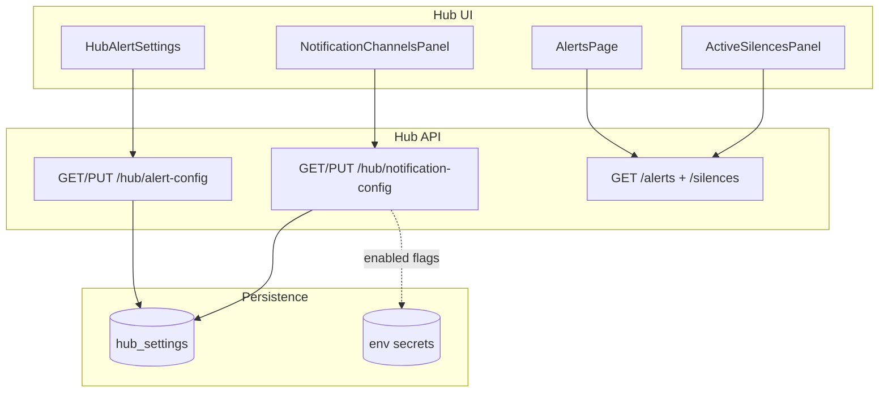
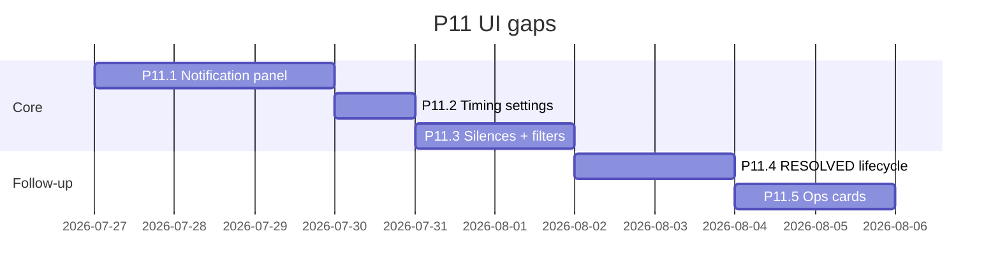

# P11 UI gaps — implementation plan

**Status:** Implemented (Phases 1–5, Jul 2026)  
**Context:** Backend P11 (channels, silence, sustained rules, offline catalog) shipped; several features are env/API-only. ADR-011 intended channel config via hub REST — implementation diverged.

**Goal:** Operators configure alerts from the hub UI without editing env files for day-to-day changes. Secrets stay in env (V10).

---

## Gap inventory

| Area | Backend | UI today | Target |
|------|---------|----------|--------|
| Webhook / Slack / Discord / SMTP | ✅ env | ❌ | Status + non-secret SMTP fields in UI |
| Sustained window (`5m`) | ✅ env | ❌ | Hub alert settings |
| Offline after (`24h`) | ✅ env | ❌ | Hub alert settings |
| Active silences list | ✅ `GET /silences` | ❌ (add only) | List + revoke |
| Alert filters (agent, status, severity) | partial API | ❌ | Alerts page |
| Auto RESOLVED | ✅ engine + API | ✅ filter + resolved_at | Done (P11.4) |
| Hub stats | ✅ API | ✅ ops card on `/hub` | Done (P11.5) |
| Probe targets | ✅ env | ❌ | Deferred |
| History retention / profile | ✅ API (hub config) | ✅ read-only ops panel | Done (P11.5) |

---

## Principles

1. **Secrets in env** — webhook URLs, SMTP password, ingest token never returned by API or stored in `hub_settings` plaintext (V10).
2. **Additive API** — extend `alert-config` or add `notification-config`; no breaking changes (V6/V7).
3. **i18n** — all new strings EN + TR (V20).
4. **Hub-only** — no agent UI for notification channels (V21).
5. **Persist non-secrets** — SMTP host/port/from/to, sustained minutes, offline hours → `hub_settings` when history enabled.

---

## Architecture

---

## Phase 1 — Notification channels panel (P11.1)

**Effort:** ~2–3 days  
**User value:** High — fixes the “EmailNotifier with no UI” problem.

### Backend

- New `NotificationConfigSnapshot` (persisted in `hub_settings` key `notification_config`):
  - `smtpHost`, `smtpPort`, `smtpUser`, `smtpFrom`, `smtpTo[]`
  - `slackEnabled`, `discordEnabled`, `webhookEnabled`, `emailEnabled` — **read-only**, derived from env at runtime
- `GET /api/v1/hub/notification-config`:
  - Returns persisted SMTP fields + `channels: { webhook, slack, discord, email }` each `{ enabled: bool, source: "env" }`
  - Never returns URLs or passwords
- `PUT /api/v1/hub/notification-config`:
  - Updates SMTP non-secret fields only
  - Rebuild `EmailNotifier` on hub (hot reload via `alert.ReloadNotifiers(cfg, notifCfg)`)
- Env overrides: if `METRICS_ALERTS_SMTP_HOST` set, mark `smtpSource: "env"` and disable PUT for those fields

### Frontend

- New section on Hub page (below alert thresholds): **Notification channels**
  - Badge per channel: Active (env) / Inactive / Configured (hub SMTP)
  - SMTP form: host, port, from, to (password hint: “set `METRICS_ALERTS_SMTP_PASSWORD`”)
  - Doc link to `docs/HUB.md#alerts`
- i18n: `hub.notifications.*`

### Tests

- API round-trip persist SMTP fields
- GET never leaks webhook URL from env
- `ComposeNotifiers` uses persisted SMTP when env empty

### Exit

- Operator can enable email without editing YAML on server restart only for password

---

## Phase 2 — Alert timing in UI (P11.2)

**Effort:** ~1 day

### Backend

- Extend `ConfigSnapshot` (additive JSON):
  - `sustainedWindowMinutes` (default 5, `0` = instant)
  - `offlineAfterHours` (default 24)
- `LoadConfigStore` merges with env defaults
- Runner reads from `ConfigStore` instead of raw `config.Config` for sustained window and offline after (or config store wins when persisted)
- `GET /api/v1/hub/config` already exposes ms — align with alert-config or document single source

### Frontend

- Add to `HubAlertSettings`:
  - Sustained window (minutes)
  - Offline threshold (hours)
- Tooltips explaining live vs stale vs offline

### Exit

- Dev `staleAfterMs=10s` behavior documented; prod uses UI values

---

## Phase 3 — Alerts page completeness (P11.3)

**Effort:** ~2 days

### Active silences

- `DELETE /api/v1/alerts/silences/{id}` or `POST .../silence/revoke`
- UI: collapsible **Active silences** on `/alerts` with agent, rule, expires, revoke button

### Filters

- Client-side or query params: `agentId`, `status`, `severity`, time range
- `GET /api/v1/alerts?agentId=&status=&limit=` if not already supported

### Alert detail drawer (optional)

- Expand row → JSON details, link to agent drill-down

### Exit

- MSP can see what is silenced without calling API manually

---

## Phase 4 — Alert lifecycle RESOLVED (P11.4)

**Effort:** ~2 days backend + 0.5 day UI

- Engine: when metric returns below threshold for `sustainedWindow`, mark event `RESOLVED` in `alert_events`
- `POST /api/v1/alerts/{id}/resolve` (manual)
- AlertsPage: filter RESOLVED, show resolved_at

**Dependency:** Phase 2 sustained window semantics

---

## Phase 5 — Ops visibility (P11.5, optional)

**Effort:** ~1–2 days

| Feature | UI |
|---------|-----|
| `GET /hub/stats` | Small card: ingest OK/error, alerts sent/failed |
| History retention | Read-only: profile, retention days, DB path |
| Probe targets | Textarea + save (persist `probe_config` in hub_settings) — needs agent push of probe config or hub-only display |

Lower priority than Phases 1–3.

---

## Implementation order

**Recommended first PR:** Phase 1 (notification panel) — smallest vertical slice that fixes the user-reported gap.

---

## Council checklist

| Rule | Phase 1–3 |
|------|-----------|
| V6/V7 additive API | ✅ new fields only |
| V10 no secrets in API/logs | ✅ env for URLs/passwords |
| V16 UI via REST not logs | ✅ |
| V20 i18n EN+TR | ✅ |
| V21 hub-only | ✅ |

---

## Out of scope (this plan)

- Encrypted secret store in SQLite
- Per-agent notification routing
- PagerDuty / Opsgenie integrations
- Full rule DSL YAML editor (future P11.5+)

---

## Doc updates on completion

- `docs/HUB.md` — notification-config API table
- `docs/DECISIONS/ADR-011` — note UI completion
- `README.md` — operator setup vs secrets
- `docs/HISTORY_ALERTS_DIAGNOSTICS_PLAN.md` — Phase 11 exit checkboxes

---

## Related

- [ADR-011](../DECISIONS/ADR-011-alert-lifecycle.md)
- [ADR-014](../DECISIONS/ADR-014-agent-catalog-offline.md)
- [HUB.md](../HUB.md)
