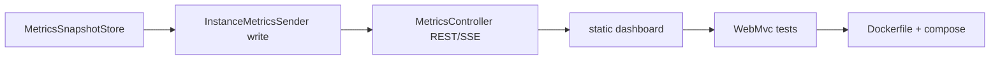

# Ürün Spec — instance-metric-collector (Outpost)

Pazar analizi çıktısı. **Runtime:** Go agent + hub (ADR-009; Java kaldırıldı). Hedef: **self-hosted host + Docker izleme** — 1–20 sunuculu küçük ekipler, homelab ve MSP.

**Konumlandırma (Jul 2026):** Beszel/Netdata ile kafa kafaya değil; *“süreç + servis + diagnostics + hub history ile özelleştirilebilir, tek binary, cross-platform agent + hub”*. Çalışma adı: **Outpost** (`outpost-agent` / `outpost-hub`). Detay: [`COMPETITIVE_PLAN.md`](COMPETITIVE_PLAN.md).

---

## Tasarım ilkeleri

### 1. Agent host'u yormaz (V21, ADR-013)

> Agent, çalıştığı instance'i yormamalı ve darboğaz olmamalı.

| Kural | Uygulama |
|-------|----------|
| İnce agent | Top-N süreç, sınırlı probe, tek ticker döngüsü |
| Ağır iş hub'da | History, rollup, sustained alert, diagnostics trend |
| Non-blocking | Push, SQLite, webhook collect path'te senkron değil |
| Görünürlük | `agentMemoryBytes`, `agentGoroutines`, `collectDurationMs` payload'da |
| Headless prod | `METRICS_UI_ENABLED=false` + push → minimum footprint |

Detay: [`DECISIONS/ADR-013-agent-lightness.md`](DECISIONS/ADR-013-agent-lightness.md)

---

## Problem

| Kim | Sorun |
|-----|-------|
| Küçük ekip / homelab | Prometheus+Grafana kurmak saatler sürüyor |
| Docker Compose kullanan | Container + host birlikte görülmek isteniyor |
| Self-hosted tercih eden | SaaS monitoring maliyeti ve veri lokasyonu endişesi |
| MSP / çoklu host | Merkezi hub + geçmiş + alarm yaşam döngüsü gerekir |

## Çözüm (güncel mimari)

```
┌──────────────────┐     HTTPS/JSON      ┌──────────────────┐
│ outpost-agent    │ ──────────────────► │ outpost-hub      │
│ per host         │   push + heartbeat  │ + React dashboard│
└──────────────────┘                     └──────────────────┘
       │                                          │
       └── local dashboard (opsiyonel)            └── history SQLite + alerts + diagnostics
```

MVP-1: **tek host + local dashboard**. Hub çoklu host (M6) ve geçmiş/alarmlar (G5–G7, P10–P12) tamamlandı veya devam ediyor — bkz. [`GO_REWRITE_PLAN.md`](GO_REWRITE_PLAN.md).

---

## Hedef kitle

Detaylı persona ve senaryolar: [`MARKET_SCENARIOS.md`](MARKET_SCENARIOS.md)

### Birincil (MVP-1)

| Segment | Özet |
|---------|------|
| Homelab / self-hoster | 1–5 VPS, Grafana istemeyen |
| Docker Compose ekipleri | Host + container birlikte |
| Küçük MSP / ajans | Hub + history + alert ACK |

### İkincil (MVP-2+)

| Segment | Özet | Öncelik |
|---------|------|---------|
| TR MSP / KOBİ | Multi-tenant, TR UI, KVKK | Yüksek |
| Windows filo (kiosk/POS) | Outbound agent, watchdog | Yüksek |
| Edge / IoT Docker | Firewall arkası push | Orta |
| CI/CD runner filoları | Build makinesi doygunluk | Orta |
| Ajans / hosting | Paylaşım linki, rapor | Orta |
| Air-gapped / kamu | Offline hub | Orta |
| Eğitim / lab | Toplu kurulum | Düşük |

**Monitoring-only:** Patch, remote access, PSA/ticketing kapsam dışı — [`MARKET_SCENARIOS.md`](MARKET_SCENARIOS.md).

---

## MVP tanımı

**Slogan:** *“`docker compose up` ile kur, tarayıcıdan izle.”*

### MVP kapsamı (MVP-1)

| # | Özellik | Faz | Zorunlu |
|---|---------|-----|---------|
| M1 | Canlı dashboard (CPU, RAM, süreç, servis, container) | Phase 3 | Evet |
| M2 | SSE veya polling ile otomatik yenileme | Phase 3 | Evet |
| M3 | `metrics.ui.enabled` headless mod | Phase 3 | Evet |
| M3b | **UI i18n: EN + TR**, dil seçici | Phase 3 | Evet |
| M4 | `docker compose` tek komut kurulum | Phase 5 | Evet |
| M5 | README demo + kurulum < 5 dk | Docs | Evet |

### MVP dışı (bilinçli erteleme)

| Özellik | Neden ertelendi |
|---------|-----------------|
| OAuth / multi-user | Pro |
| Prometheus exporter | Entegrasyon fazı |
| Uzun süreli TSDB (Prometheus uyumlu) | Scope dışı; hub SQLite yeterli MVP için |
| Windows production polish | Linux/macOS önce |
| AI diagnostics | MVP-4+ (kural tabanlı P12 önce) |

---

## Kullanıcı hikayeleri (MVP-1)

### US-1 — İlk kurulum
**Olarak** homelab kullanıcısı  
**İstiyorum ki** 5 dakikada agent'ı çalıştırıp tarayıcıda metrik göreyim  
**Böylece** Grafana kurmadan sunucumu izleyebilirim  

**Kabul kriterleri:**
- [ ] `make run` veya `docker compose up` sonrası `http://localhost:8080` açılır
- [ ] CPU ve RAM yüzde olarak görünür
- [ ] Son güncelleme zamanı gösterilir

### US-2 — Docker container izleme
**Olarak** Docker Compose kullanıcısı  
**İstiyorum ki** container'ların durum, health ve restart sayısını göreyim  
**Böylece** hangi servisin düştüğünü anında anlarım  

**Kabul kriterleri:**
- [ ] Container listesi `containers` alanından gelir
- [ ] `exited` / `unhealthy` görsel olarak ayırt edilir
- [ ] Docker yoksa boş liste, uygulama çökmez

### US-3 — Süreç ve servis listesi
**Olarak** sysadmin  
**İstiyorum ki** en çok kaynak tüketen süreçleri ve çalışan servisleri göreyim  

**Kabul kriterleri:**
- [ ] Süreç tablosu en az PID, isim, CPU%, bellek gösterir
- [ ] Servisler durum badge ile listelenir

### US-4 — Headless agent
**Olarak** otomasyon kullanıcısı  
**İstiyorum ki** UI olmadan sadece JSON log üretmeye devam edebileyim  

**Kabul kriterleri:**
- [ ] `metrics.ui.enabled=false` ile web katmanı yüklenmez
- [ ] Log çıktısı Phase 1 ile aynı kalır

### US-5 — Dil seçimi
**Olarak** Türkçe konuşan kullanıcı  
**İstiyorum ki** dashboard'u Türkçe görebileyim ve dili kolayca değiştirebileyim  
**Böylece** teknik terimleri kendi dilimde takip edebilirim  

**Kabul kriterleri:**
- [ ] Varsayılan dil tarayıcıya göre (`tr` → Türkçe)
- [ ] Header'da dil seçici (EN / TR)
- [ ] Seçim `localStorage`'da kalır, sayfa yenilemede korunur
- [ ] Tüm UI etiketleri çevrilir; API JSON alan adları değişmez

---

## MVP-2 (pazar doğrulama sonrası)

| # | Özellik | Değer |
|---|---------|-------|
| M6 | Merkezi hub + çoklu agent kaydı | Gerçek “ürün” hissi |
| M7 | Basit alert (CPU/RAM/container → webhook) | Rakiplerle eşitlik |
| M8 | Disk/network grafikleri | Phase 6 + dashboard |
| M9 | Ek diller (de, ar, …) | Talebe göre |

**Hub mimarisi (taslak):**

```
Agent                          Hub
POST /api/v1/ingest            MetricsIngestController
  + agentId                      → per-agent latest + history
  + MetricsPayload               → dashboard /agents/{id}
```

Phase 2 HTTP push bu ingest API'ye evrilir.

---

## MVP-2.5 (Jul 2026 — kısmen tamamlandı)

Geçmiş analiz, gelişmiş alarmlar ve tanı. Detay: [`HISTORY_ALERTS_DIAGNOSTICS_PLAN.md`](HISTORY_ALERTS_DIAGNOSTICS_PLAN.md)

| # | Özellik | Durum | Faz |
|---|---------|-------|-----|
| M20 | Kalıcı hub history + Historic UI (Live \| History) | ✅ P10 | Phase 10 |
| M21 | Alert platformu (kurallar, geçmiş, ACK UI) | ⚠️ ACK + liste; silence/kanallar sırada | Phase 11 |
| M22 | Diagnostics (insight + runbook önerileri) | ✅ kural motoru + UI | Phase 12 |

**MVP-2 tamamlandı:** M6 hub, M7 webhook alert, M8 disk/network UI, G6 release/install script.

---

## MVP-3 (pazar genişlemesi — aday)

MVP-2 ve beta feedback sonrası; her madde ayrı phase gate + kullanıcı onayı.

| # | Özellik | Segment | Faz adayı |
|---|---------|---------|-----------|
| M10 | Multi-tenant hub (Partner → Müşteri → Agent) | TR MSP, ajans | Phase 8 |
| M11 | White-label / tema | TR MSP | Phase 8 |
| M12 | Windows Service + systemd kurulum | Kiosk, POS | Phase 9 |
| M13 | Süreç/servis watchdog kuralları | Kiosk, hosting | Phase 9 |
| M14 | PDF / email periyodik sağlık raporu | MSP, ajans | MVP-3 |
| M15 | Read-only paylaşım linki (token) | Ajans, hosting | MVP-3 |
| M16 | Prometheus `/metrics` exporter | Java shop | MVP-3 |
| M17 | `spring-boot-starter` embed modülü | Platform ekipleri | MVP-3 |
| M18 | ~~SQLite kalıcı history (hub)~~ → Phase 10 (M20) ile birleşti | Edge, air-gapped | Phase 10 |
| M19 | GraalVM native image (footprint) | Edge | Araştırma |

Detay: [`MARKET_SCENARIOS.md`](MARKET_SCENARIOS.md) · Faz backlog: [`PHASE_GATES.md`](PHASE_GATES.md)

---

## Teknik MVP backlog (sıralı)



| Sprint | İş | Tahmini |
|--------|-----|---------|
| 1 | `MetricsSnapshotStore`, DTO, sender entegrasyonu | 2–3 gün |
| 2 | REST `/current`, `/history`, SSE `/stream` | 2 gün |
| 3 | Dashboard HTML/CSS/JS + i18n (en/tr) + dil seçici | 3–4 gün |
| 4 | Testler + smoke güncelleme + README demo GIF | 1–2 gün |
| 5 | Dockerfile + `docker-compose.yml` | 1 gün |

**Toplam MVP-1:** ~2 hafta (tek geliştirici, yarı zamanlı ~3–4 hafta).

---

## Başarı metrikleri (MVP-1)

| Metrik | Hedef |
|--------|-------|
| Kurulum süresi | < 5 dakika (README adımları) |
| İlk dashboard görüntüleme | Agent start + 60 sn içinde veri |
| Bellek (agent) | < 256 MB JVM heap (ölç ve dokümante et) |
| Beta kullanıcı | 5 homelab/ajans geri bildirimi |
| GitHub | README'de demo, 1 release tag |

---

## Rekabetten farklılaşma (pitch)

| Rakip | Bizim fark |
|-------|------------|
| Beszel (Go) | Spring/Java — ekip özelleştirebilir |
| Prometheus stack | Tek JAR, sıfır scrape config |
| Netdata | Daha hafif hedef değil; daha basit, daha az özellik |
| Log-only agent (bugün) | UI + (ileride) hub |

**Dürüst sınır:** JVM ağırlığı kabul; “en hafif agent” iddiası yok.

---

## Fiyatlandırma taslağı (MVP sonrası)

| Katman | İçerik | Hedef segment |
|--------|--------|---------------|
| **OSS (MIT)** | Agent, local dashboard, JSON log | Homelab, Java shop |
| **Pro** | Hub, alert, multi-tenant, white-label, rapor | TR MSP, ajans |
| **Hizmet** | On-prem kurulum, MSP lisansı, eğitim | TR KOBİ |

### MSP fiyat modeli (taslak)

| Model | Açıklama | Referans |
|-------|----------|----------|
| **Flat hub** | Aylık sabit — N agent’a kadar | Fivenines ~€27/ay |
| **Per-agent** | Agent başı ücret (10+ filo) | Klasik RMM |
| **Community** | Hub OSS, Pro özellikler lisanslı | NetLock CE ≤25 endpoint |

Önerilen başlangıç: **flat hub** (10 agent dahil) + aşım için per-agent — basit satış, homelab OSS kalır.

MVP-1 tamamen OSS; gelir MVP-2 Pro hub + MSP hizmet ile.

---

## Riskler

| Risk | Azaltma |
|------|---------|
| Rakipler olgun | Niş: Spring shop + basitlik |
| JVM RAM | Dokümante et; headless mod |
| Scope creep | MVP-1'de hub/alert yok |
| Güvenlik (açık 8080) | MVP'de localhost bind; prod ADR ile auth |

---

## Karar özeti

| Soru | Karar |
|------|-------|
| İlk niş? | Küçük ekip + Docker + Spring familiarity |
| İlk deliverable? | Phase 3 local dashboard |
| Hub ne zaman? | MVP-2, 5 beta feedback sonrası |
| TR lokalizasyon? | MVP-1 (Phase 3) — EN + TR zorunlu |

---

## İlgili dokümanlar

- [`MARKET_SCENARIOS.md`](MARKET_SCENARIOS.md) — müşteri segmentleri ve senaryolar
- [`UI_PLAN.md`](UI_PLAN.md) — ekran ve API detayı
- [`PHASE_GATES.md`](PHASE_GATES.md) — faz çıkış kriterleri
- [`DECISIONS/ADR-003-metrics-dashboard.md`](DECISIONS/ADR-003-metrics-dashboard.md)
- [`TECH_DEBT.md`](TECH_DEBT.md)

## Onay

Phase 3 (V19) implementasyonu için bu spec MVP-1 kapsamını tanımlar. Hub ve alert MVP-2 olarak `PHASE_GATES.md` Phase 7'ye eklenebilir.
