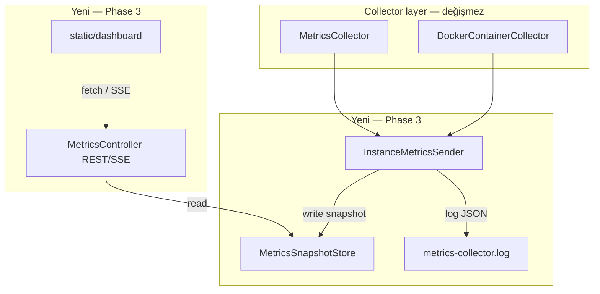
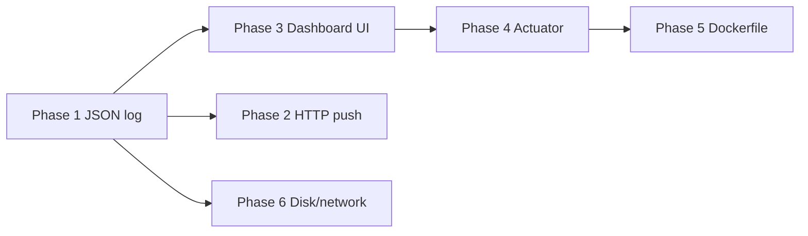

# Metrics Dashboard UI — Plan

Canlı metrik görüntüleme arayüzü. Phase 3 kapsamında; implementasyon Phase 2'den bağımsız başlayabilir (onay sonrası).

## Hedef

Kullanıcının tarayıcıdan host metriklerini **sürekli ve anlaşılır** şekilde izlemesi:

- CPU ve bellek kullanımı (yüzde + trend)
- Çalışan süreçler tablosu
- Servis durumları
- Docker container kartları (health, restart, port)

Agent'ın log-tabanlı ruhu korunur: UI **log dosyasını parse etmez**; collector'dan gelen son snapshot'ı okur.

## Mimari (önerilen)



### Yeni bileşenler

| Bileşen | Paket / path | Rol |
|---------|--------------|-----|
| `MetricsSnapshotStore` | `service/` veya `web/` | Thread-safe son snapshot + ring buffer (ör. son 60 ölçüm) |
| `MetricsController` | `web/` | REST + SSE endpoint'leri |
| Dashboard | `src/main/resources/static/` | Tek sayfa SPA benzeri (vanilla JS, ek build yok) |

### API taslağı

| Endpoint | Method | Açıklama |
|----------|--------|----------|
| `/api/metrics/current` | GET | Son `MetricsPayload` + `collectedAt` timestamp |
| `/api/metrics/history` | GET | Son N snapshot (sparkline / trend için) |
| `/api/metrics/stream` | GET (SSE) | Her yeni toplamada event push |
| `/` veya `/dashboard` | GET | Dashboard HTML |

### Konfigürasyon

```properties
metrics.ui.enabled=true
metrics.ui.history.size=60
metrics.ui.refresh.interval=5000   # SSE yoksa polling ms
metrics.ui.default-locale=en
metrics.ui.locales=en,tr
server.port=8080
```

`metrics.ui.enabled=false` → web katmanı yüklenmez; headless agent modu (V18).

## UI ekran tasarımı

```
┌─────────────────────────────────────────────────────────────┐
│  instance-metric-collector   [EN ▾]   ● Live   Last: 12:34:05 │
├─────────────────────────────────────────────────────────────┤
│  ┌──────────────┐  ┌──────────────┐  ┌──────────────┐       │
│  │ CPU  42%     │  │ RAM  6.2/16 │  │ Containers 3 │       │
│  │ ▁▂▃▅▃▂▁     │  │ ████████░░░ │  │ 2 healthy    │       │
│  └──────────────┘  └──────────────┘  └──────────────┘       │
├─────────────────────────────────────────────────────────────┤
│  Süreçler (top 10)          │  Servisler                    │
│  PID  NAME      CPU%  MEM   │  ● nginx  ● ssh  ○ docker    │
│  ...                        │  ...                          │
├─────────────────────────────────────────────────────────────┤
│  Docker containers                                          │
│  ┌─────────┐ ┌─────────┐                                   │
│  │ api     │ │ redis   │  status / health / ports            │
│  └─────────┘ └─────────┘                                   │
└─────────────────────────────────────────────────────────────┘
```

### UX ilkeleri

1. **Sıfır kurulum** — `make run` sonrası `http://localhost:8080` açılır
2. **Otomatik yenileme** — SSE birincil; fallback polling
3. **Okunabilir birimler** — byte → MB/GB, CPU yüzde
4. **Durum renkleri** — healthy=yeşil, exited=kırmızı, unhealthy=turuncu
5. **Mobil uyumlu** — tek sütun responsive layout (basit CSS grid)
6. **Karanlık mod** — `prefers-color-scheme` ile (opsiyonel Phase 3b)
7. **Çoklu dil** — EN + TR (MVP); dil seçici, `localStorage` ile kalıcı (V20)

## Uluslararasılaştırma (i18n)

Phase 3 **zorunlu** kapsam. API alan adları İngilizce kalır; yalnızca UI metinleri çevrilir.

### Dosya yapısı

```
static/
  locales/en.json
  locales/tr.json
  js/i18n.js
```

### Davranış

| Öncelik | Kaynak |
|---------|--------|
| 1 | `localStorage.metrics.ui.locale` (kullanıcı seçimi) |
| 2 | `metrics.ui.default-locale` (application.properties) |
| 3 | `navigator.language` (`tr*` → TR, aksi halde EN) |
| 4 | `en` fallback |

### Konfigürasyon

```properties
metrics.ui.default-locale=en
metrics.ui.locales=en,tr
```

### UI bileşenleri (çevrilecek)

- Başlık, kart etiketleri (CPU, RAM, Containers)
- Tablo sütun başlıkları (PID, Name, Status, …)
- Durum metinleri (Healthy, Exited, Unhealthy, Running)
- Boş durum mesajları (“No containers”, “Docker disabled”)
- Dil seçici etiketleri
- Zaman ifadeleri — `Intl.DateTimeFormat` ile locale-aware

### Kalite

- `tool/i18n_lint.sh` — `en.json` / `tr.json` key parity (CI veya pre-push opsiyonel)
- Yeni string → tüm locale dosyalarına ekle (V20)

Detay: [`DECISIONS/ADR-004-dashboard-i18n.md`](DECISIONS/ADR-004-dashboard-i18n.md)

## Teknoloji seçimi

| Seçenek | Artı | Eksi | Karar |
|---------|------|------|-------|
| Thymeleaf + HTMX | Server-rendered, Spring-native | Ek dependency | Hayır |
| Static HTML + REST/SSE | Mevcut `starter-web`, build yok | JS elle yazılır | **Evet** |
| React/Vue SPA | Zengin UI | Ayrı build pipeline, ağır | Hayır (şimdilik) |

Detay: [`DECISIONS/ADR-003-metrics-dashboard.md`](DECISIONS/ADR-003-metrics-dashboard.md)

## Faz bağımlılıkları



- Phase 3, Phase 2'den **önce** yapılabilir (lokal izleme öncelikli)
- Phase 4 Actuator ile çakışmaz: Actuator = ops health; Dashboard = kullanıcı metrik UI

## Exit kriterleri (Phase 3)

- [ ] `MetricsSnapshotStore` — thread-safe write/read, configurable history size
- [ ] `InstanceMetricsSender` her döngüde store'a yazar (log'a ek olarak)
- [ ] REST: `/api/metrics/current`, `/api/metrics/history`
- [ ] SSE: `/api/metrics/stream` (veya polling fallback dokümante)
- [ ] Dashboard: CPU, RAM, süreçler, servisler, container'lar
- [ ] i18n: `en` + `tr` locale dosyaları, dil seçici, V20 uyumu
- [ ] `tool/i18n_lint.sh` key parity kontrolü
- [ ] `metrics.ui.enabled=false` ile headless mod (V18)
- [ ] Unit test: controller + store
- [ ] Smoke veya yeni `make ci-ui` — dashboard 200 + API JSON alanları
- [ ] README'de erişim URL'si

## Test planı

| Katman | Ne test edilir |
|--------|----------------|
| Unit | `MetricsSnapshotStore` ring buffer, concurrent access |
| WebMvcTest | `MetricsController` JSON şeması, SSE content-type |
| i18n lint | `tool/i18n_lint.sh` — en/tr key parity |
| Smoke (opsiyonel) | `curl /api/metrics/current` + static `index.html` 200 |

## Güvenlik notları

- Dashboard varsayılan olarak **auth'sız** (lokal dev agent). Production için Phase 3b veya Phase 4 ile basic auth / reverse proxy ADR gerekir.
- Süreç listesi hassas bilgi içerebilir — V10: API response'da secret yok.
- `metrics.ui.enabled` production'da bilinçli açılmalı (V19).

## Gelecek genişlemeler (Phase 10–12 — planlama)

Detay: [`HISTORY_ALERTS_DIAGNOSTICS_PLAN.md`](HISTORY_ALERTS_DIAGNOSTICS_PLAN.md)

### Historic mod (Phase 10)

- Header toggle: **Live | History**
- Zaman aralığı seçici (1s / 6s / 24s / 7g / özel)
- CPU, RAM, disk % trend grafikleri (hub + agent dashboard)
- Veri kaynağı: kalıcı store (SQLite hub); log parse yok (V16)

### Alert merkezi (Phase 11)

- `/alerts` veya hub sekmesi — açık olaylar, filtre, ACK
- Kural tanımları (UI veya config)
- Webhook dışı kanallar (email/Slack — MVP-3)

### Diagnostics paneli (Phase 12)

- Agent detayında insight kartları (CPU spike, disk trend, agent stale, …)
- Runbook önerileri — locale JSON (V20)
- Export (destek ticket metni)

## İlgili dokümanlar

- [`HISTORY_ALERTS_DIAGNOSTICS_PLAN.md`](HISTORY_ALERTS_DIAGNOSTICS_PLAN.md) — geçmiş / alarm / tanı yol haritası

- [`PHASE_GATES.md`](PHASE_GATES.md) — Phase 3 tanımı
- [`ARCHITECTURE.md`](ARCHITECTURE.md) — paket haritası güncellemesi
- [`VETO_REGISTRY.md`](VETO_REGISTRY.md) — V16–V20
